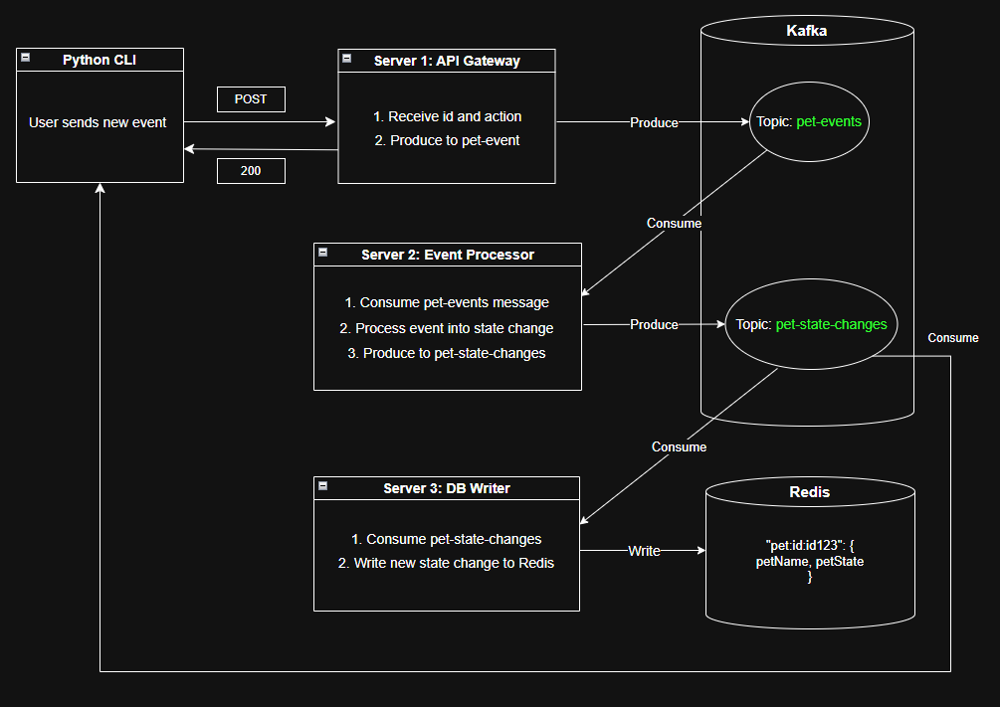

# Architecture
## Overview
Event-driven microservices using Kafka as message stream and Redis for state persistence.

## System Components
### Services
In `/services` folder:
1. **API Gateway** (`/api`)
    - Receives user actions and publishes events
2. **Event Processor** (`/event-processor`)
    - Consumes events, processes into new pet state, publishes state changes
3. **Database Writer** (`/db-writer`)
    - Writes state changes to Redis

### Infrastructure
In `/services/libs` folder:
1. **Kafka** (`/kafka`)
    - Message broker with topic-based publish/subscribe operations
    - `pet-events`: User action commands
    - `pet-state-changes`: Computed state updates
2. **Redis** (`/redis`)
    - Key-value store for pet sate persistence