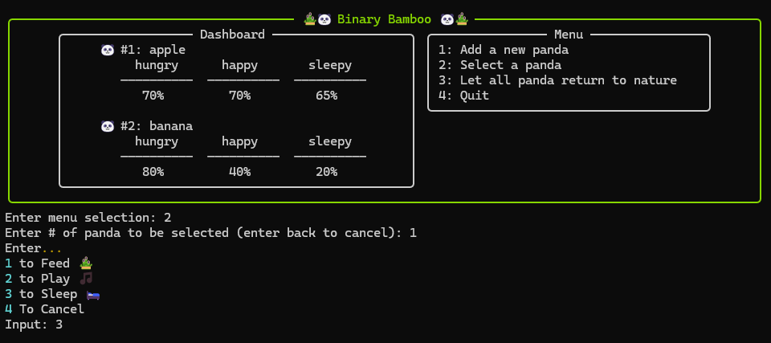

# Binary Bamboo

**Get pet panda in your terminal :panda_face:**

## Preview


## Features
- Interactive Terminal UI
- Create and choose actions on pets
- Concurrent state changes reflected to UI


## Tech Stack
- Python (CLI)
- Node.js (Microservices)
- Kafka (Message streams)
- Redis (Cache database)

** Check out Architecture.md for more information on how each services communicate to each other


## Installation
Frist, clone the repo:
```
git clone https://github.com/joanne5548/binary-bamboo.git
```

### Client
Set up a virtual environment using either:

1. Conda (Recommended)
```bash
cd client
conda env create -f environment.yml
```

2. Pip
```bash
cd client
pip install -r requirements.txt
```

And run the CLI.
```bash
python main.py
```

### Server
Prerequisite: Docker Desktop is installed and running.

First, run Docker container:
```bash
cd server
docker compose up -d
```

And run microservices:
```bash
cd server
npm run dev
```
> [!Note] Servers might not connect to Kafka on first try. If error message "this server does not host this topic" is observed, terminate current process, and re-try the above command.


## Directory Structure
1. `/client`
    - Contains Terminal UI application
2. `/services`
    - Contains 3 servers and dependency directory
    1. `/api`: API Gateway
    2. `/event-processor`: Event processor; logic for event -> state
    3. `/db-writer`: Database writer to Redis
    - `/libs`: Dependencies
        1. `/interfaces`: Contains interfaces
        2. `/kafka`: Contains Kafka operations
        3. `/redis`: Contains Redis operations


## Environment Variables
Note that setting up environment variables is not a requirement for this application.
### Frontend
Placed in `/client` directory.
1. `SERVER_DOMAIN`: Server domain. Default: localhost
2. `PORT`: Port # to send API requests. Default: 8080

### Backend
#### API
Placed in `/server/api` directory.
1. `SERVER_DOMAIN`: Server domain. Default: localhost
2. `PORT`: Port # to send API requests. Default: 8080


## Todo
- [ ] Create `Architecture.md`
- [ ] Adjust UI width
- [ ] Refactor client folder structure - create src directory
- [ ] Fully test shutdown logic for Kafka


## Contact
**Joanne Kim** </br>
You can reach me at: joanne.kim0328@gmail.com </br>
[Visit my website!](joannekim.dev) | [LinkedIn](https://www.linkedin.com/in/jkim0328)